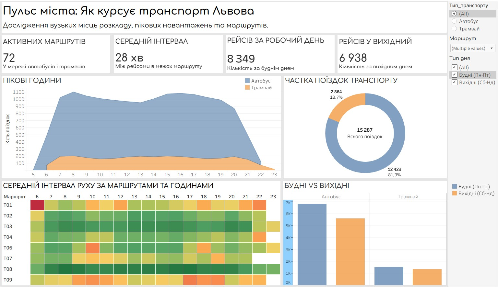
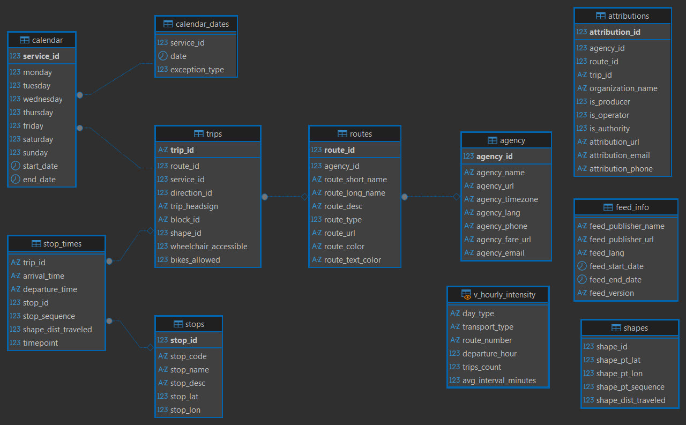

# Аналіз планового розкладу транспорту Львова (GTFS)

Аналітичний розбір розкладу міського транспорту Львова на основі офіційного GTFS-пакету «Львівавтодору» (72 маршрути, 1 061 зупинка, понад 15 тисяч планових рейсів і 420K+ рядків зупиночних подій) 

Дані обробив у PostgreSQL, розрахував фактичний такт руху, результат зібрав в дашборд у Tableau

🔗 **Інтерактивний дашборд:** [Tableau Public](https://public.tableau.com/views/Dashboard_17878787258220/sheet8?:language=en-US&:sid=&:redirect=auth&:display_count=n&:origin=viz_share_link)

---

## Стек технологій та інструменти

* **СУБД та моделювання:** PostgreSQL. Побудова реляційної схеми, спільні табличні вирази (CTE), віконні функції (`LAG`) для розрахунку міжрейсових інтервалів, агрегація даних у кастомну аналітичну таблицю (View) та конвертація часових типів (`INTERVAL`, `EXTRACT(EPOCH...)`)
* **BI та візуалізація даних:** Tableau Desktop / Tableau Public. Побудова матриці інтервалів (Heatmap), профілю пікових навантажень (Area Chart), порівняльних стовпчикових діаграм, розрахункові поля (Calculated Fields) та синхронізована крос-фільтрація між блоками.
* **Джерело даних:** Відкриті дані «Львівавтодору» у форматі GTFS Static (нормативні таблиці `routes`, `trips`, `stop_times`, `calendar`).

---

## Що я перевіряв у даних
* Коли в місті настають реальні години пік і коли транспорт увечері припиняє курсувати.
* На скільки рейсів менше місто закладає у вихідні дні.
* Яка реальна частка рейсів припадає на трамваї проти автобусів.
* На яких конкретно маршрутах і в які години виникають найбільші провали в інтервалах.

---

## Що показали розрахунки
* **Автобуси виконують 81.3% усіх рейсів.** Трамвайна мережа покриває лише 18.7% випусків. Місто майже повністю залежить від ситуації з автомобільними заторами.
* **У вихідні випуск падає на 16.9%.** У будній день заплановано 8 349 рейсів на добу, а у вихідні — 6 938. Автобуси зрізають сильніше (-17.3%), тоді як розклад трамваїв залишається стабільнішим (-11.6%).
* **Ранковий пік настає рівно о 08:00.** У цей час стартує понад 1 100 рейсів на годину. Вечірній пік розтягується з 16:00 до 17:00. Після 20:00 випуск різко спадає, а після 23:00 плановий рух автобусів повністю припиняється.
* **Провали в інтервалах.** Якщо магістральний трамвай Т08 стабільно тримає інтервал 11–14 хвилин, то на багатьох автобусних маршрутах між 11:00 та 14:00 планове очікування триває 30–50 хвилин.

---

## Як готувалися дані (SQL)

Таблиця `stop_times` містить понад 420K записів проходження кожної зупинки. Щоб не перевантажувати Tableau «важкими» з'єднаннями, усі розрахунки я виніс у таблицю `v_hourly_intensity` безпосередньо в PostgreSQL:
1. Через `MIN(departure_time)` зафіксував час виїзду з початкової зупинки кожного рейсу.
2. Порахував реальний інтервал між сусідніми машинами одного напрямку за допомогою віконної функції `LAG()` з групуванням за `direction_id`.
3. Агрегував кількість рейсів і середній такт руху за годинами та типами днів (будні/вихідні).

---

## Структура дашборду
1. **Картки показників (KPI):** Добовий випуск рейсів окремо для буднів та вихідних, середній розрахунковий інтервал по місту.
2. **Профіль відправлень:** Погодинний графік випуску з розбивкою на автобуси й трамваї.
3. **Хітмап інтервалів:** Матриця маршрутів і годин доби, де кольором підсвічено ділянки з очікуванням понад 25–40 хвилин.
4. **Порівняння випуску:** Стовпчикова діаграма скорочення рейсів у розрізі видів транспорту.

---

## Обмеження даних
Аналіз побудовано на **нормативному розкладі (GTFS Static)**. Він показує запланований рух транспорту без урахування заторів, ремонтів доріг, поломок автобусів або фактичних запізнень.

---

## Файли проєкту
* `sql/v_hourly_intensity.sql` — створення розрахункової таблиці інтенсивності та інтервалів руху.
* `tableau/` — робоча книга звіту `.twbx`.
* `assets/` — схема бази даних та прев'ю дашборду.
